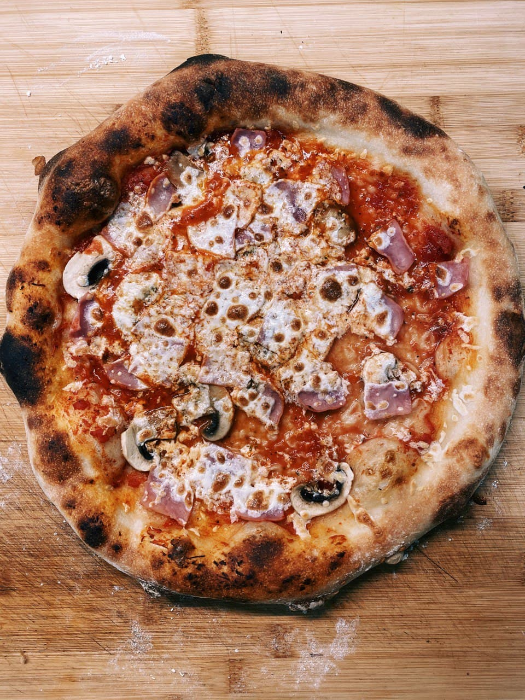
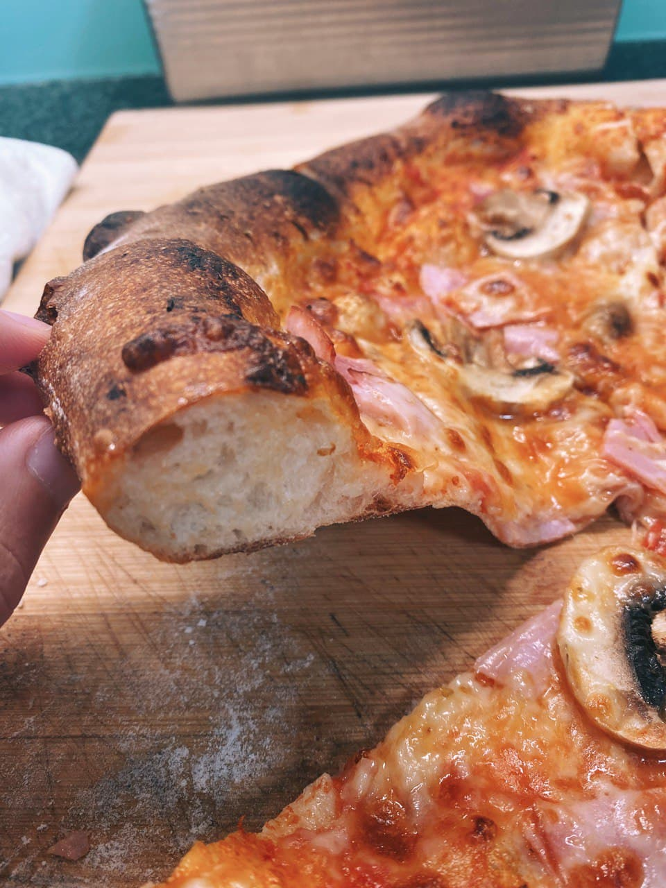

# Best Homemade Pizza

Tasty and straightforward homemade pizza based on the original recipe from [Pizza Camp](https://www.amazon.com/Pizza-Camp-Recipes-Pizzeria-Beddia/dp/1419724096) and Joe Beddia.

<div>
  
  
</div>

### Ingredients
```
355 ml cool water
2 tbsp (25 gr) sugar
½ tsp (1.42 gr) active dry yeast
1 tbsp (6.86 gr) extra-virgin oil
500 gr of all-purpose or bread flour
1 tbsp + ½ tsp (20 gr) fine salt
```

Topping is up to you I usually go with:

```
Tomato sauce: smashed tomatoes + garlic
Oregano
Fresh mozzarella cheese
Ham
Big mushrooms
Olive-oil
Pepper powder
```

### Process

You'll prepare this dough **one day before cooking the pizza**. Although the process is lengthy, I assure you it is 100% worth it. It's by far the best homemade dough I've come across.

Having a baking stone (even if it's a $10 one) will dramatically increase and improve your dough's spring and texture.

#### Dough sequence (24h before cooking)

1. Find yourself a `big bowl`; we will be making dough for two pizzas, `454 gr` each. You can keep them in the fridge for a few days, don't worry.
1. Put and mix in the bow the `water` + `sugar` + `yeast` thoroughly.
1. Mix in the `olive oil`.
1. Mix in the `flour`. Take your time. Make sure everything is evenly incorporated with your hands. You can also use a blender with a dough hook for about `4-5 minutes` at slow speed.
1. After `30 minutes`, mix in the `salt`. Again, take your time to make sure things are evenly integrated. Please don't add the salt before the waiting time, and it will ruin the gluten structure.
1. Cover the bowl with a towel and let it rest for `24 hours` in the `fridge`.
1. After the 24 hours, take the dough out of the fridge and drop it onto a well-floured and clean table. You will shape the dough into a `ball` with well-floured hands, grabbing the dough's end and pulling it up to meed the middle of the dough. Repeat this rotating the dough in quarters until you get a nice and smooth texture.
1. With a knife, split the dough in two smaller balls. Repeat the same process until you get two smooth dough balls. Don't be shy with the flour, but don't put it directly in the dough, just use it to get the smooth non-sticky texture.
1. Keep the balls a bit apart from eachother and cover them with a towell for 2 or 3 hours until they double in size.


#### Cooking sequence
1. Pre-heat the oven up to the `maximum temperature` for `one hour` before cooking the pizza.
1. If you have the dough in the fridge, take it out and let it rest for `30 minutes` before using it.
1. You will shape the dough in two steps.
1. `First`: with your hand open, smash the ball with the hand of your palm, removing the air gently from it. Start making small stretches to the sides to widen the dough.
1. `Second`: you pick up the dough, and with the help of your arm and the dough's weight, you can start stretching the pizza a bit more until you are happy with the size.
1. Small tip: try to leave some border so the pizza will grow more prominent on the sides.
1. Add the ingredients in order: `tomato sauce`, `oregano`, `cheese`, `ham`, and `mushrooms` in slices.
1. Place the pizza in the oven, preferably the lowest position (to maximize the heat). Leave it there for `5 minutes`.
1. Switch the oven to `broil`, and leave it there for 4-5 minutes.
1. Take the pizza out of the oven.
1. Add some olive-oil and pepper.

Enjoy your pizza!

### Credits

This recipe is a personal take based on the original recipe from [Pizza Camp](https://www.amazon.com/Pizza-Camp-Recipes-Pizzeria-Beddia/dp/1419724096).